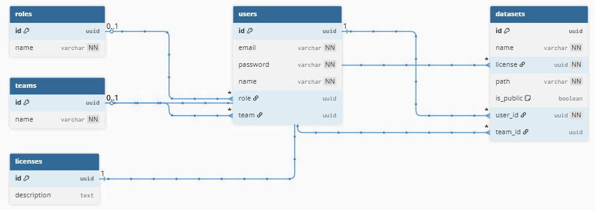

<h1 style="text-align: center; font-size: 2.5rem; color: #284b8c">Documento de Especificação Funcional</h1>
<h2 style="text-align: center; font-size: 2rem; color: #284b8c">SDNN</h2>

# Registro de Revisões
| Versão |    Data    |    Notas de revisão     | Responsável |
| :----: | :--------: | :---------------------: | :---------: |
|  1.0   | 04/04/2026 | Elaboração do Documento |   Rafael    |

<!--# Sumário
- [[#1. Introdução|1 Introdução]]
	- [[#1.1 Objetivo|1.1 Objetivo]]
	- [[#1.2 Definições, acrônimos e abreviações|1.2 Definições, acrônimos e abreviações]]
- [[#2. Premissas|2 Premissas]]
- [[#3. Definição de Escopo|3. Definição de Escopo]]
	- [[#3.1 Dentro do Escopo|3.1 Dentro do Escopo]]
	- [[#3.2 Fora de Escopo|3.2 Fora de Escopo]]
- [[#4. Modelo Entidade Relação|4. Modelo Entidade Relação]]
- [[#5. Dicionário de Dados|5. Dicionário de Dados]]
	- [[#5.1 Tabela users|5.1 Tabela users]]
	- [[#5.2 Tabela roles|5.2 Tabela roles]]
	- [[#5.3 Tabela teams|5.3 Tabela teams]]
	- [[#5.4 Tabela datasets|5.4 Tabela datasets]]
	- [[#5.5 Tabela licenses|5.5 Tabela licenses]]

 -->

# 1. Introdução
## 1.1 Objetivo
Este documento tem como objetivo especificar o banco de dados do sistema.
## 1.2 Definições, acrônimos e abreviações

| Sigla/Termo |                                    Significado                                     |
| :---------: | :--------------------------------------------------------------------------------: |
|    SDNN     |                          Sistema de Datasets Não Nomeado                           |
|     CSV     |    Formato de arquivo para planilhas onde os valores são separados por vírgulas    |
|     CSV     | Sigla de Structured Query Language, em português linguagem de consulta estruturada |
|    UUID     |                           Identificador Único Universal                            |
# 2. Premissas
Temos como premissas para o escopo inicial do SDNN:
- O upload inicial de *datasets* será limitado a arquivos no formato CSV, sendo responsabilidade do usuário garantir a integridade e padronização mínima dos dados enviados.
# 3. Definição de Escopo
## 3.1 Dentro do Escopo
Este documento define a estrutura do banco de dados relacional para o SDNN, detalhando as entidades, atributos e relacionamentos necessários para suportar as regras de negócio do sistema.
## 3.2 Fora de Escopo
Está fora do escopo desse documento abordar questões específicas sobre a arquitetura do projeto, questões de performance e coisas similares.
# 4. Modelo Entidade Relação

# 5. Dicionário de Dados
## 5.1 Tabela: users
Armazena as informações de identificação dos usuários.

| Campo    | Tipo    | Descrição                                       |
| -------- | ------- | ----------------------------------------------- |
| id       | UUID    | Identificador único do usuário.                 |
| email    | Varchar | Endereço de e-mail (único) para autenticação.   |
| password | Varchar | Hash da senha de acesso.                        |
| name     | Varchar | Nome completo do usuário.                       |
| role     | UUID    | Referência ao papel do usuário na tabela roles. |
| team     | UUID    | Referência ao time ao qual o usuário pertence.  |
## 5.2 Tabela: roles
Armazena o privilégio de cada usuário

| Campo | Tipo    | Descrição                        |
| ----- | ------- | -------------------------------- |
| id    | UUID    | Identificador único do papel.    |
| name  | Varchar | Nome do papel (ex: admin, user). |
## 5.3 Tabela: teams
Gerencia os grupos criados para compartilhamento privado de dados.

| Campo | Tipo    | Descrição                    |
| ----- | ------- | ---------------------------- |
| id    | UUID    | Identificador único do time. |
| name  | Varchar | Nome identificador do time.  |
## 5.4 Tabela: datasets
Contém os metadados e as referências para os arquivos controlados pelo DVC.

| Campo     | Tipo        | Descrição                                         |
| --------- | ----------- | ------------------------------------------------- |
| id        | UUID        | Identificador único do dataset.                   |
| name      | Varchar     | Nome do dataset.                                  |
| license   | UUID        | Referência ao tipo de licença na tabela licenses. |
| path      | Varchar     | Caminho do arquivo no sistema/DVC.                |
| is_public | Boolean     | Define se o dataset é público.                    |
| user_id   | Foreign Key | Usuário responsável pelo dataset.                 |
| team_id   | Foreign Key | Time ao qual o dataset pertence (opcional).       |
## 5.5 Tabela: licenses
Tabela com todas as licenças disponíveis para atribuir aos *datasets* 

| Campo       | Tipo | Descrição                       |
| ----------- | ---- | ------------------------------- |
| id          | UUID | Identificador único da licença. |
| description | Text | Descrição detalhada da licença. |